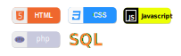

# Hi there, my name is Colton Van Bastelaere👋

## I’m currently working on 
- A platform designed to help local businesses get online for cheap, because it matters to me!
- An online events cataloging tool
## 🌱 I’m currently learning ...
I am always learning, even the things I feel I understand well. With that being said, I am learning NodeJS, React, PHP, SQL and MongoDB

## 👯 I’m looking to collaborate on:
Web development projects that have a good cause
## 🌐 I’m looking for help with:
Connecting to individuals such as myself-- life-long learners who are passionate about their work
## 📫 Please feel free to contact me, 
You can reach me at my [LinkedIn](https://www.linkedin.com/feed/) profile!
